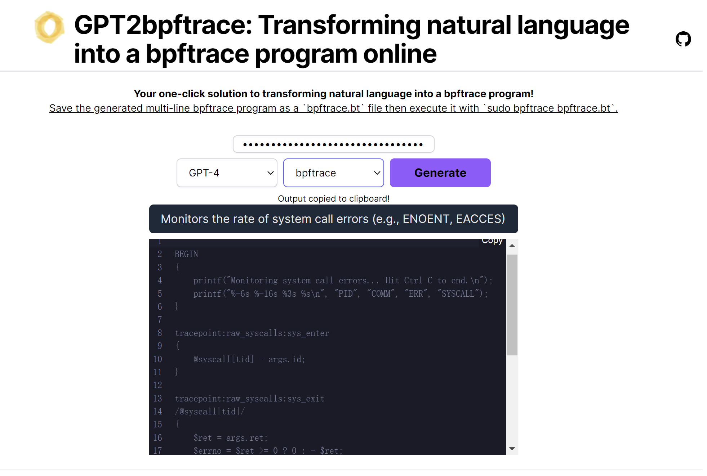

# 🚀 GPT2Bpftrace: Transform Natural Language into Bpftrace Programs

Welcome to GPT2Bpftrace! Harness the power of AI to automatically generate bpftrace programs just by entering natural language commands. Built upon the OpenAI's GPT and the ever-versatile [bpftrace](https://github.com/iovisor/bpftrace).

<p align="center">
  
</p>

### **Checkout our related paper [Kgent: Kernel Extensions Large Language Model Agent](https://dl.acm.org/doi/10.1145/3672197.3673434) in eBPF'24!**

## 🌐 **Try It Online**

Why wait? Test it right now at [GPT-2-Bpftrace](https://gpt-2-bpftrace.vercel.app/).

1. Enter your natural language command into the left text box.
2. The AI-generated bpftrace program will appear in the right text box.
3. Copy the generated program, save it locally, e.g., as `gpt-bpftrace.bt`.
4. Run it with bpftrace using the command:

```console
$sudo bpftrace gpt-bpftrace.bt
```

## 🖥 **Run It Locally**

Prefer running it on your machine? Here's how:

### **1. Get the Code**

```bash
git clone https://github.com/eunomia-bpf/GPT2Bpftrace.git
```

### **2. Install Necessary Dependencies**

Before you get started, ensure you have all the needed packages.

```bash
npm install
```

### **3. Fire It Up!**

```bash
npm run dev
```

Now, navigate to your local server and see GPT2Bpftrace in action!

## 🌟 **Features**

- **Intuitive UI**: Seamless conversion from natural language to bpftrace programs.
- **AI-Powered**: Utilizes the advanced capabilities of OpenAI's GPT.
- **Open Source**: Dive deep into the code, contribute, or customize it to your liking.

## 📖 **How ot works**

Discover the depths and details of GPT2Bpftrace in the README of [GPTtrace](https://github.com/eunomia-bpf/GPTtrace)

## 🙌 **Contribute**

Contributions are always welcome!

## 📝 **License**

This project is licensed under [MIT License](LICENSE).
